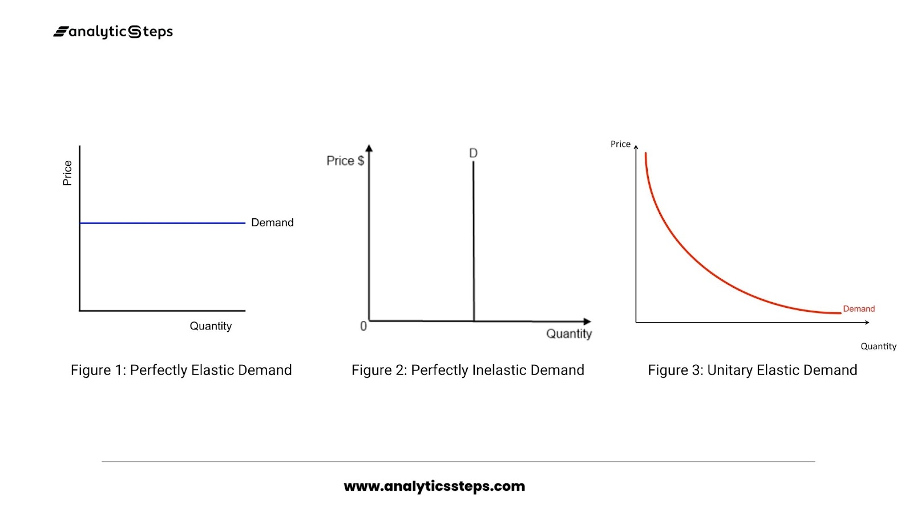
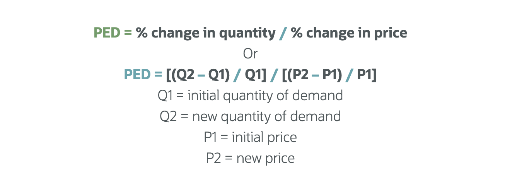
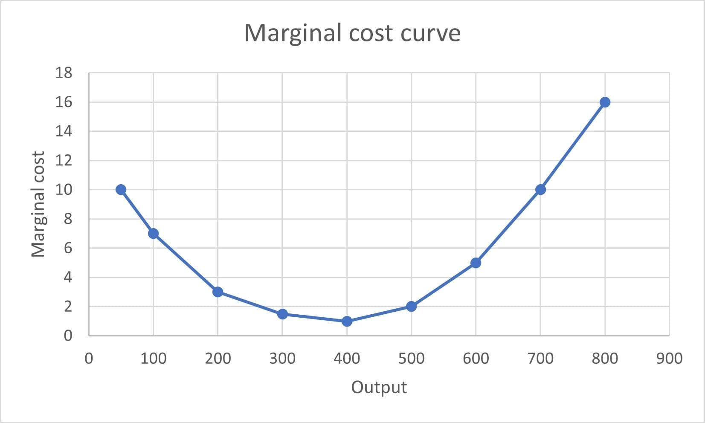

In this course, I mainly studied demand and elasticity analysis, the relationship between production and cost functions, how market structures affect business decisions, the application of game theory in corporate competition, and problems caused by information asymmetry. These topics helped me understand how firms make optimal operational decisions in real-world market environments.

## Demand and demand elasticity analysis

https://www.netsuite.com/portal/resource/articles/business-strategy/elasticity-of-demand.shtml

In this course, I mainly learned about **demand and demand elasticity analysis**. This is a study of how sensitive consumers are to price changes for goods. 

- For example, if the price of apples goes up by 10%, how much will the quantity people buy decrease? 

That ratio is called "price elasticity of demand." We use a formula: elasticity = percentage change in quantity demanded ÷ percentage change in price. 

- If the result is greater than 1, demand is "elastic," like soda—when the price rises slightly, many people switch to other drinks. If it's less than 1, it's "inelastic," like rice or medicine—you still have to buy them even if prices go up. 

The professor gave an example: when a city’s subway fare increased from 3 yuan to 4 yuan, ridership only dropped by 5%. So the elasticity is 5% ÷ 33.3% ≈ 0.15, which means demand is very insensitive—people rely on the subway to get to work. 

This knowledge is crucial for business pricing: if you're selling a product with inelastic demand, you can raise prices to increase profits; if it's elastic, you must be careful, or customers will leave.

## The relationship between production functions and cost functions

In this course, I mainly learned about **the relationship between production functions and cost functions**. Simply put, a production function describes the technical relationship between inputs (like workers and machines) and outputs (like how many phones are produced), while a cost function translates those inputs into monetary terms. 

- For example, a factory with 10 machines and 20 workers produces 1,000 phones per month—that’s the production function. 

But to know how much it costs to produce one additional phone, we need the cost function. Two key concepts here are "marginal cost" and "economies of scale." 

**Marginal cost** is the extra cost of producing one more unit. At first, it might be low—for example, the 100th phone costs 800 yuan—but as output increases, equipment gets strained and workers do overtime, so the cost may rise to 900 or even 1,000 yuan. **Economies of scale** refer to the phenomenon where average cost decreases as output increases. 

- For instance, when Xiaomi first started making phones, the per-unit cost was high, but once production reached millions, bulk purchasing and improved efficiency lowered the average cost. 

However, blind expansion can lead to "**diseconomies of scale**," such as management chaos reducing efficiency. We also studied the "learning curve," meaning that as experience accumulates, the time and cost needed to produce the same amount of output gradually decrease—just like how a new driver wastes fuel, while an experienced driver drives more efficiently.

## How firms make decisions under different market structures

In this course, I mainly learned about **how firms make decisions under different market structures**, especially perfect competition, monopoly, and oligopoly. Market structure determines how much control a firm has over pricing. 

In a "perfectly competitive" market, like agricultural markets, there are many sellers offering identical products, and no single seller can set the price—they just accept the market price. A wheat farmer cannot charge a higher price alone, otherwise no one will buy, so he is a "price taker." 

In this case, the firm’s optimal strategy is to produce where "marginal cost equals price" to maximize profit. In contrast, in a "pure monopoly" market, like a city’s water supply company, there is only one provider—it becomes a "price maker." It can restrict supply and set a higher price to earn more profit. But governments usually regulate such firms to prevent abuse. The most complex is "oligopoly," like China’s smartphone market, dominated by Huawei, Xiaomi, OPPO, and vivo. These companies watch each other closely—if one cuts prices, others quickly follow. In this situation, a firm must not only consider its own costs and demand but also anticipate competitors’ reactions—it’s like playing chess.

## The application of game theory in corporate competitive strategies

In this course, I mainly learned about **the application of game theory in corporate competitive strategies**. Game theory sounds abstract, but it’s actually about strategic thinking: when you take an action, how will others respond, and how should you react? We studied a classic case called the "Prisoner’s Dilemma." Two suspects are interrogated separately. If both stay silent, they each get 1 year in prison. If one betrays the other, the betrayer goes free, and the silent one gets 10 years. If both betray each other, they each get 8 years. The rational choice is to betray, but the outcome is worse for both. This is like two airlines: if both keep prices high, they both profit. But if one secretly lowers prices to steal customers, the other loses money. Eventually, both may cut prices, leading to a “price war” where neither makes money. However, we also learned about "repeated games"—if two firms compete long-term, they may learn to cooperate to avoid mutual destruction. For example, airfares don’t drop sharply during Chinese New Year travel season because companies know they’ll compete again next year, so there’s no need to fight to the death. Another example is "first-mover advantage": when Xiaomi launched high-performance smartphones at low prices in 2011, it seized market leadership early—a leading strategy in "sequential games."

---

在这门课程中，我主要学习了**信息不对称带来的市场问题**，比如“逆向选择”和“道德风险”。这两个概念听起来专业，但在生活中很常见。所谓“逆向选择”，是指交易前信息不透明导致劣质品驱逐优质品。最经典的例子是二手车市场：买家不知道哪辆车是好车（“桃子”），哪辆是坏车（“柠檬”），所以只愿出个中间价。这样一来，好车车主觉得价格太低不愿卖，坏车车主却很高兴，结果市场上全是坏车。这就是“劣币驱逐良币”。为了解决这个问题，平台可以引入第三方检测或保修服务，比如瓜子二手车提供100项检测和一年保修，增加了买家信任。而“道德风险”是指交易后一方行为改变损害另一方利益。比如买了车险的人可能开车更 reckless（鲁莽），因为他知道出了事故保险公司买单。保险公司为了控制风险，会设置免赔额或根据驾驶记录调整保费。这些机制设计对我们理解市场经济的局限性非常重要，也解释了为什么需要监管和制度保障。

In this course, I mainly learned about **market problems caused by information asymmetry**, such as "adverse selection" and "moral hazard." These terms sound technical, but they’re very common in daily life. "Adverse selection" happens when hidden information before a transaction leads to bad products driving out good ones. The classic example is the used car market: buyers don’t know which cars are good (“peaches”) and which are lemons, so they offer only an average price. As a result, owners of good cars think the price is too low and withdraw from the market, while owners of bad cars are happy to sell—so eventually, only bad cars remain. This is "bad money drives out good." To solve this, platforms can introduce third-party inspections or warranties. For example, Guazi Used Cars offers 100-point inspections and one-year warranties, building buyer trust. "Moral hazard" refers to one party changing behavior after a deal to the other’s detriment. For instance, someone with car insurance might drive more recklessly, knowing the insurer will pay for accidents. To manage this risk, insurers set deductibles or adjust premiums based on driving history. Understanding these mechanisms is crucial for seeing the limits of free markets and why regulations and institutional safeguards are needed.