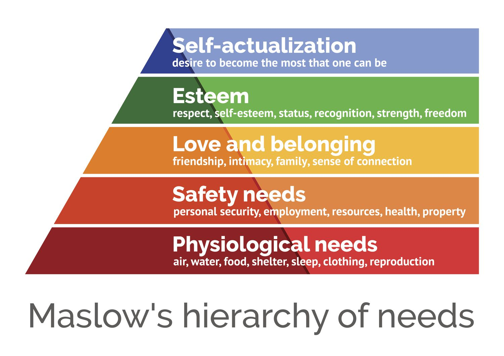
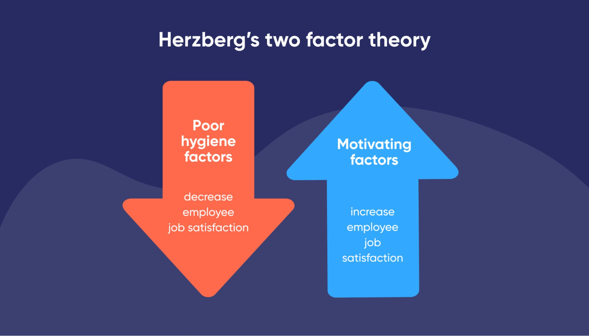

In this course, I mainly studied management functions, organizational structure, leadership theories, motivation theories, and the decision-making process—these are the core pillars of management studies. 

They help me understand how organizations are built, operated, and improved, much like learning about the skeleton, nerves, and circulatory system of the human body—each part plays a different role, but all work together to keep the whole system functioning. 

## Management Functions

In this course, I mainly studied management functions, which include four basic elements: planning, organizing, leading, and controlling. 

1. **Planning** means setting goals and designing action plans—for example, the owner of a new coffee shop might decide to open three branches within a year, and then create a monthly schedule for store openings, budget allocations, and staff recruitment. 
2. **Organizing** refers to assigning tasks and resources—such as dividing responsibilities like finance, procurement, and store operations among different departments, and clearly defining reporting lines. 
3. **Leading** involves motivating and guiding employees—like a store manager encouraging and training staff to provide better customer service. 
4. **Controlling** means monitoring performance—such as checking monthly sales figures, and if one store underperforms, analyzing whether it's due to location, service quality, or product issues, and making timely adjustments. 

These four functions are not one-time activities—they form <u>a continuous cycle, much like driving a car: constantly checking the GPS (planning), steering the wheel (organizing), pressing the gas or brake (leading), and watching the road (controlling)</u>. Only by continuously doing all four can you reach your destination safely.

## Organizational Structure

In this course, I mainly studied organizational structure, which is **the framework that defines how jobs, departments, and authority are arranged within a company.** 

For instance, a company might use **a functional structure**, <u>separating departments</u> like marketing, finance, and HR, each focusing on their specialized area—this works well for small or medium-sized businesses. 

Alternatively, **a divisional structure** could be used—like Haier Group, a large Chinese company, which has <u>separate divisions</u> for refrigerators, washing machines, and air conditioners. Each division operates like a "mini-company" with its own R&D, production, and sales teams, allowing faster responses to different market needs. 

We also learned about flat versus hierarchical structures: 

1. a **flat structure** has few levels—like a startup tech company with only three layers (CEO, team leads, and employees), <u>enabling faster communication and more employee autonomy</u>. 
2. In contrast, a **hierarchical structure**, like in the military or traditional banks, has many management layers, <u>leading to slower decision-making but clearer responsibilities</u>. 

<u>The choice of structure directly affects communication efficiency and decision speed</u>. Choosing the wrong one is like making a soccer team follow an orchestra’s pattern—it would be rigid and out of sync.

## Leadership Theories

In this course, I mainly studied leadership theories, which explore what kinds of leadership styles are more effective. We focused on two classic models: transformational and transactional leadership. 

**Transformational leaders** <u>inspire and motivate employees to go beyond their limits</u>—like Jack Ma in the early days of Alibaba, constantly painting the vision of “making it easy to do business anywhere,” which <u>inspired employees’ sense of mission and creativity, keeping the team highly engaged even during tough times.</u> 

**Transactional leaders**, on the other hand, <u>focus on clear rewards and punishments</u>—like a sales manager telling the team: “Double your bonus if you hit the target this quarter; if not, you’ll attend extra training.” This style works well when tasks are clear and results are measurable. 

We also discussed situational leadership theory, which says that leadership style should adapt to the maturity level of subordinates. 

- For example, with a new employee, you need more direction and supervision (directive style); with an experienced but unmotivated veteran, you need more encouragement and support (supportive style). It’s like teaching a child to ride a bike: for a complete beginner, you hold the bike and teach them how to pedal; for one who knows how but lacks confidence, you stand nearby shouting, “You can do it!”—different situations call for different approaches.

## Motivation Theories

In this course, I mainly studied motivation theories, which **explain why people work and how they can be effectively motivated**. We focused on Maslow’s Hierarchy of Needs and Herzberg’s Two-Factor Theory. 

**Maslow’s Hierarchy of Needs** proposed that human needs are like a five-level pyramid: starting from basic physiological needs (like salary and food), then safety needs (job stability), social needs (team belonging), esteem needs (promotion, recognition), and finally self-actualization (creative work, personal growth). 

- For example, a recent graduate might care most about whether their salary covers rent (physiological need), while a senior engineer may care more about whether a project is challenging and reflects their professional value (self-actualization). 

**Herzberg’s Two-Factor Theory**, on the other hand, distinguished between “hygiene factors” and “motivators.” Salary, work environment, and company policies are hygiene factors—they don’t directly motivate, but their absence causes dissatisfaction, much like vitamins: lacking them makes you sick, but taking extra won’t make you fly. In contrast, achievement, responsibility, and growth opportunities are motivators—they truly drive people to engage deeply in their work. 

- For instance, Google allows employees to spend 20% of their time on self-chosen projects, which directly led to the creation of Gmail and Google News. These theories help managers design more human-centered motivation systems, rather than simply assuming “more money solves everything.”

## Decision-Making Process

In this course, I mainly studied the decision-making process, which is how managers systematically choose the best course of action when facing problems. We learned a five-step model: problem identification, information gathering, alternative generation, evaluation and selection, and implementation with feedback. 

1. For example, a food delivery platform notices increasing customer complaints about long delivery times—this is **problem identification**. 
2. Then, by analyzing data, they find that there aren’t enough riders during peak hours—this is **information gathering**. 
3. Next, they generate three options: increase rider subsidies, optimize route algorithms, or partner with third-party logistics, called **alternative generation**.
4. Then they evaluate each option’s cost and impact: subsidies might cost 5 million RMB per month and improve on-time delivery by 15%, while algorithm optimization costs 2 million RMB but improves it by 20%. They finally choose algorithm optimization. This is **evaluation and selection.**
5. After implementation, they continuously monitor delivery times and adjust based on user feedback, called **implementation with feedback**.

We also discussed the difference between rational and bounded rationality decision-making: rational decision-making assumes managers have all information and can make the optimal choice, but in reality, information is incomplete and time is limited, so decisions are often “satisficing” (good enough) rather than optimal. 

- It’s like finding a restaurant in a new city—you won’t walk past every single one before choosing; instead, you pick one with a 4.5+ rating within a 5-minute walk. Good enough is often sufficient. This structured process helps managers avoid impulsive decisions and improve organizational efficiency.