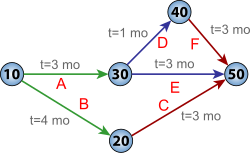

In this course, I mainly studied the project life cycle and phase management, Work Breakdown Structure (WBS), Critical Path Method (CPM). These are the most central and practical components in project planning and management. 

They help us **transform a vague idea into an executable, monitorable, and controllable task flow step by step**. 

## The project life cycle and phase management

In this course, I mainly learned about the project life cycle and phase management, which refers to managing the entire process of a project from "birth" to "end." Any project—such as constructing an office building—doesn’t happen all at once but is divided into several major phases: **initiation, planning, execution, monitoring & controlling, and closing**. Together, these five phases form the "project life cycle." 

1. For example, during the **initiation** phase, we determine whether the project is worth doing—like evaluating if the cost of building this office makes sense. 
2. In the **planning** phase, we create detailed blueprints, schedule timelines, and set budgets. 
3. During **execution**, workers actually start laying foundations, building walls, and installing pipes. 
4. The **monitoring** phase involves the project manager checking daily whether progress is behind schedule or if costs are exceeding the budget. 
5. Finally, in the **closing** phase, we inspect and accept the building, hand over the keys, and summarize lessons learned. 

<u>This phased approach is like dividing a human life into childhood, adolescence, adulthood, and old age—each stage has its own focus and tasks, and none can be skipped or reversed</u>. This method **allows us to systematically control the rhythm of the entire project and avoid chaos**.

## Work Breakdown Structure

Work Breakdown Structure (WBS), which is **a method for breaking down a large project into smaller, manageable tasks**. 

- Imagine you’re preparing a big dinner with a main course, soup, and dessert. If you just say “I’m going to cook,” that’s too vague to act on. So you break it down: the main course is braised pork, the soup is tomato-egg drop soup, and the dessert is fruit salad. Then each dish is further broken into steps: shopping, washing, cutting, cooking. 

WBS does exactly this—it’s a tree-like diagram that breaks down a project goal into smaller and smaller actionable task packages. 

- For example, in a software development project, the top level might be “develop a mobile app,” the second level could include “front-end development,” “back-end development,” “database design,” and “testing,” and the third level would go deeper—for instance, under “front-end development” you’d have “login page design” and “user home layout.” 

Each task is assigned a responsible person, timeline, and budget. The benefit is that no critical step gets missed, and everyone knows exactly what to do. In class, we did a simulation project: developing a course registration system for our university. We used WBS to break the entire project into 6 Level-1 tasks, 23 Level-2 tasks, and 41 specific work packages. This made even a complex project clear and manageable.

## Critical Path Method

Critical Path Method (CPM), which **helps identify the most important and time-consuming sequence of tasks in a project, thus determining the shortest possible project duration.** 

- Think of it like a highway with many toll stations—some delays won’t affect the total travel time, but if one critical section gets jammed, the whole trip is delayed. CPM helps us find that “most vulnerable” section. The method works like this: first, list all tasks, note how long each takes, and define their dependencies. 

- For example, you must lay the foundation before building walls; you must write code before testing software. Then, we draw a network diagram and calculate the total time for each possible path. The longest path is the “critical path.” Any delay on this path directly delays the entire project. 

- For instance, in building a small warehouse, we listed tasks: design (5 days), material procurement (7 days), foundation (3 days), wall construction (6 days), roof installation (4 days), interior finishing (5 days). The sequence design → procurement → foundation → walls → roof → finishing totals 5+7+3+6+4+5 = 30 days—the longest of all paths—so it’s the critical path. If we want to shorten the project, we must focus on tasks along this path. For example, reducing procurement from 7 to 5 days would save 2 days overall. 

CPM shows us where the “bottleneck” is, so we can allocate resources efficiently.