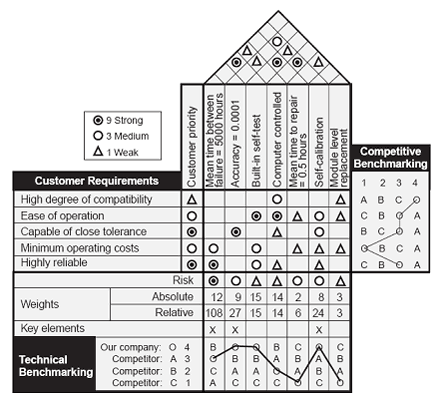

In this course, I mainly studied Statistical Process Control (SPC), Quality Function Deployment (QFD), sampling inspection theory, quality cost analysis, and the ISO 9000 quality management system. 

These topics form the core of modern quality management, helping organizations **systematically improve quality** across product design, manufacturing, and after-sales service. 

QFD focuses on transforming vague customer needs into concrete product design parameters. 
Sampling inspection theory deals with how to scientifically select samples from a batch of products for testing to determine whether the entire batch meets standards. 
Quality cost analysis examines the balance between the costs a company incurs to ensure quality and the losses caused by poor quality. 
The ISO 9000 system is about establishing a standardized, documented quality management system to ensure consistency and traceability in organizational operations.

## Statistical Process Control

Statistical Process Control (SPC) is about **monitoring quality variations in real time during production to prevent defects**. Using data charts to monitor whether a production line is stable and capable of consistently producing qualified products. 

- For example, in a bolt manufacturing workshop, the length of a bolt must be within 10.05 cm ± 0.12 cm to be considered "qualified". **If workers only inspect the batch after production, they might have already produced a large number of defective items.** The core idea of SPC is "**prevention first**." 

It uses a tool called a **Control Chart**, which acts like a thermometer to monitor the production process in real time. We randomly sample 5 bolts from the production line every hour, measure their lengths, calculate the average and range, and then plot these points on the control chart. 

The chart has three lines: the center line (CL) represents the target value, while the upper and lower control limits (UCL and LCL) are typically set at the average plus or minus three standard deviations. 

- If all points stay within the control limits and show no abnormal patterns, the process is stable. However, if any point goes beyond the limits or shows a trend—like seven consecutive points rising—it indicates a potential problem, such as machine wear or material change, requiring immediate investigation. This method allows us to detect and correct issues early, preventing mass defects. I remember a case from the textbook where a factory reduced its defect rate from 2.7‰ (2.7 per thousand) to nearly zero after implementing SPC, significantly saving costs.

## Quality Function Deployment

In this course, I mainly studied **Quality Function Deployment (QFD)**, which is **about transforming vague, subjective customer needs into specific, actionable design parameters and production targets for engineers**. 

You can think of it as a "**House of Quality**." 

- The "left wall" of this house lists what customers care about most—like "coffee should be aromatic," "price should be reasonable," or "the cup shouldn’t be too hot." 
- The "roof" contains the technical solutions engineers propose, such as "increase coffee powder concentration," "optimize packaging cost," or "use double-layer insulated cups." 
- The "room" in the middle is a matrix that scores how well each technical solution satisfies each customer need. 

For example, "increasing coffee powder concentration" might score 9 out of 10 for "coffee should be aromatic" but -3 for "price should be reasonable" because it increases cost. Through this weighted scoring, we can identify the most critical technical measures and prioritize resources accordingly. I remember the teacher gave an example of a vending machine: users want hot, tasty coffee, but simply heating the water might lead to uneven temperature. Through QFD analysis, the team decided not only to control water temperature but also to optimize brewing time and coffee grind size, ultimately creating a product that better matches real user experience. This method ensures product development isn’t engineers working in isolation, but truly customer-centered.

## Sampling inspection theory

In this course, I mainly studied **sampling inspection theory**, which is about how to judge whether a batch of products is acceptable using minimal testing cost, instead of inspecting every single item—especially when tests are destructive. 

For example, a factory produces 1,000 boxes of light bulbs, 100 per box, totaling 100,000 units. Inspecting all of them would be time-consuming and impractical, especially if the test is destructive—like testing bulb lifespan, which requires burning them out. This is where sampling inspection comes in. We learned about internationally used **counting sampling standards**, such as MIL-STD-105E. The core idea is to look up a table based on batch size and quality requirements to determine how many samples to draw and how many defects are allowed. 

- For instance, for a batch of 1,000 units, using general inspection level II and a normal single-sampling plan, we might randomly select 80 bulbs. If no more than 2 are defective, the entire batch is accepted; if more than 2, it’s rejected. 

This method is supported by the **OC curve (Operating Characteristic Curve)**, which shows the probability of wrongly accepting a bad batch or wrongly rejecting a good one. 

- For example, if the actual defect rate is 1%, the acceptance probability might be 95%; but if it rises to 5%, the acceptance probability drops below 20%. It’s like a medical blood test—doctors don’t drain all your blood to check health; they use a small sample to assess your overall condition, making it both scientific and efficient.

## Quality cost analysis

In this course, I mainly studied **quality cost analysis**, which **examines the balance between the money a company spends to ensure quality** (prevention and appraisal costs) **and the losses incurred due to poor quality** (internal and external failure costs). 

- For example, a factory spends $100,000 annually on employee training and equipment maintenance (prevention costs) and $180,000 on product inspections (appraisal costs)—these are "investments in quality." But if it skips these, it might face $150,000 in scrap losses (internal failure costs) and $40,000 in customer returns and compensation (external failure costs). 

We learned a key concept called the "**optimal quality cost**"—the point where total quality cost (prevention + appraisal + internal failure + external failure) is minimized. Usually, as prevention and appraisal costs increase, failure costs drop significantly. However, over-inspecting also wastes resources. So the optimal strategy is to moderately increase upfront investment—like enhancing training and design reviews—to catch problems early, rather than fixing or recalling products later. It’s like regular car maintenance—spending a few hundred dollars on oil changes can prevent a $5,000 engine repair, which is a smarter choice.

## ISO 9000 quality management system

In this course, I mainly studied the **ISO 9000 quality management system**, which is about ensuring that a company consistently delivers qualified products over the long term by establishing a standardized, documented system. 

ISO 9000 is not a specific technical tool but **a management framework**—like an "operating manual" for a company. It requires organizations to document all key processes—from receiving customer orders to product delivery and after-sales service—specifying who is responsible, how tasks are performed, and how records are kept. 

- For example, a software company must have documented procedures like "Requirements Review Process," "Code Inspection Procedure," and "Customer Complaint Handling Method." The company must also conduct internal audits annually and external certification audits to ensure that what is "written" matches what is "done." 

I remember the textbook emphasized that the core ideas of ISO 9000 are "process management" and "continuous improvement." It doesn’t guarantee how advanced a product is, but it ensures the company operates in a structured, traceable, and improvable way. It’s like a chain restaurant—no matter which city you're in, the hamburger tastes the same, not because every chef is a genius, but because they all follow the same standard operating procedures. Through this course, I’ve come to understand that quality management is not just a technical issue, but a systematic organizational capability.