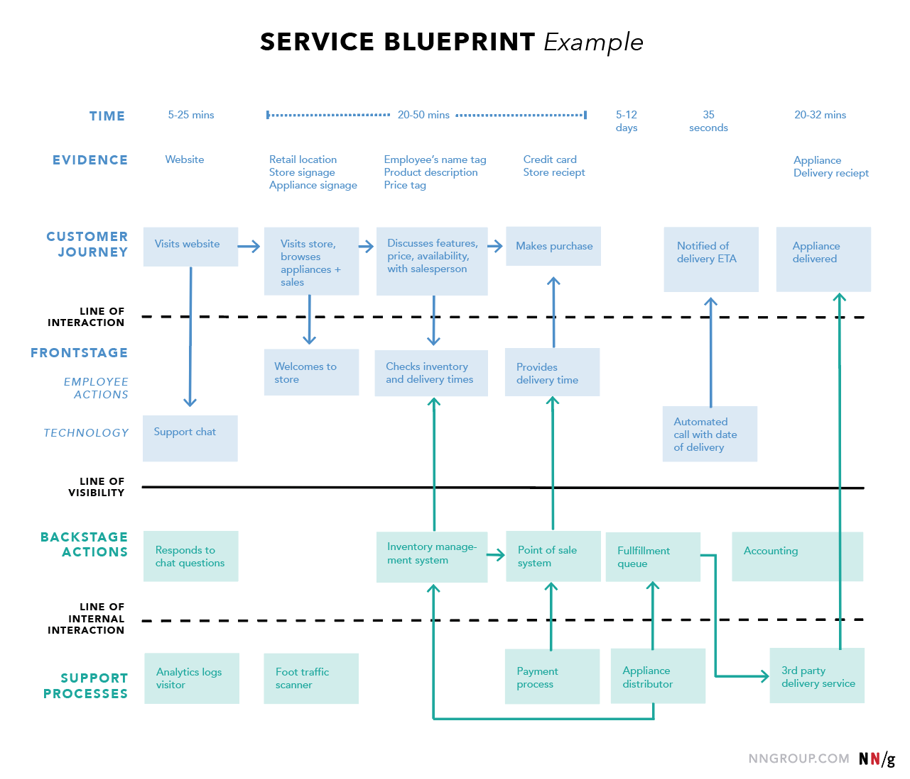
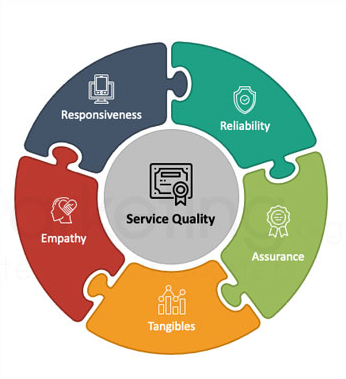

In this course, I mainly studied the nature and classification of services, service blueprinting and process design, service quality management, demand forecasting and queue management, as well as service facility layout and location design. 

These topics helped me systematically understand how service industries operate, how to design an efficient and customer-satisfying service system, and how to solve common problems like mismatches between supply and demand in service delivery.

## The nature and classification of services

In this course, I mainly learned about the nature and classification of services. The biggest difference between services and manufacturing is that services are intangible and produced and consumed at the same time. 

- For example, when we get a haircut, the hairdresser cutting our hair is the "production" of the service, while we, as customers, are "consuming" it at that very moment—both happen simultaneously. 

We learned that services have four key characteristics: **intangibility, inseparability, heterogeneity, and perishability**. 

- For instance, a hotel check-in service is intangible—you can't "see" or "touch" the quality of service beforehand; it's inseparable—the service must be delivered by staff while the customer is present; it's heterogeneous—the experience may vary depending on who serves you or when you come; and it's perishable—if the hotel has 100 empty rooms today but no one books them, that value is lost forever, unlike clothing that can be stored and sold tomorrow. 

We also studied how to classify services, such as high-contact versus low-contact based on customer involvement. Outpatient services in a hospital are high-contact—customers are involved throughout; while online bank transfers are low-contact. This classification helps us understand that different services require different design and management strategies.

## Service blueprinting and service process design

In this course, I mainly learned about service blueprinting and service process design. A service blueprint is a tool that works like a map, **visualizing the entire service process from the customer’s first contact to their final departure**. It divides the service into five layers: customer actions, front-stage employee actions, back-stage employee actions, support processes, and two critical lines—the “line of interaction” and the “line of visibility.” 

- For example, take Starbucks: customer actions include entering the store, ordering, waiting, and picking up coffee; front-stage staff actions are the cashier taking orders and baristas making coffee; back-stage staff might be restocking inventory in the storage room; support processes include supply chain management from the corporate headquarters. 

By drawing this blueprint, **managers can clearly see every step of the service and identify bottlenecks or error-prone areas**. 

- For instance, if customers often complain about long wait times, blueprint analysis might reveal that the ordering process is too slow or that coffee-making equipment is insufficient. 

We also studied different types of service process designs, such as production-line design (like McDonald’s) and professional service design (like law firms). The former emphasizes efficiency and standardization, while the latter focuses on personalization and expertise. This approach helps us design service processes like engineers designing a factory assembly line—ensuring they are both efficient and customer-satisfying.

## Service quality management

In this course, I mainly learned about service quality management. Service quality cannot be measured with rulers or machines like physical products because it heavily depends on customers’ subjective feelings. We studied a key model called **SERVQUAL**, which evaluates service quality across five dimensions: Tangibles, Reliability, Responsiveness, Assurance, and Empathy. 

- For example, in a high-end hotel, “tangibles” refer to clean sheets and modern bathroom fixtures; “reliability” means the wake-up call must be on time every day; “responsiveness” is how quickly staff respond when you request a room change at the front desk; “assurance” comes from staff professionalism that makes you feel trusted; and “empathy” is when a waiter remembers your name and coffee preference. 

We also learned the “Service Gap Model,” which identifies five potential gaps causing poor service quality—such as the gap between what managers think customers want and what customers actually want. 

- For instance, an airline might believe passengers care most about low prices, but in reality, they value on-time performance and comfort more. By identifying these gaps, companies can make targeted improvements. 

Additionally, we discussed “service recovery”—how to win back customers when service fails. 

- For example, if a hotel loses your luggage, promptly apologizing, offering compensation, and upgrading your room might actually make you more loyal. This shows that when handled well, a service failure can become an opportunity to strengthen customer relationships.

## Service demand forecasting and queue management

In this course, I mainly learned about service demand forecasting and queue management. Because services cannot be stored in inventory, matching supply and demand is crucial. 

For example, if a hospital fails to predict patient numbers during flu season, it may face staff shortages and long waiting times. We studied various forecasting methods, with time series analysis being the most common—using data from the past 12 months to predict next month’s demand. 

We used a simple **moving average**: 

- for instance, if a restaurant had 400, 420, and 410 customers over the past three weeks, the forecast for next week would be (400+420+410)÷3 = 410 customers. 

More advanced methods include **exponential smoothing** and **regression analysis**, such as using weather or holidays to predict restaurant traffic. 

In queue management, we studied queuing theory, which uses mathematical models to analyze the relationship between waiting time and the number of service counters. 

- For example, a bank has 3 tellers, with 30 customers arriving per hour on average. Each teller takes 5 minutes per customer (12 customers per hour), so total capacity is 3×12=36 customers/hour, exceeding demand. In theory, no long queues should form. But in reality, random arrival patterns still cause waiting. We calculated the average waiting time to be about 7.5 minutes. 

This analysis helps managers decide whether to add staff or streamline processes. We also learned to use computer simulation to test different scenarios, such as opening a fast lane during peak hours. These tools help service businesses better balance resources and customer experience.

## Service facility layout and location design

In this course, I mainly learned about service facility layout and location design. The design of service facilities affects not only operational efficiency but also directly shapes customer experience. 

- For example, IKEA is a classic case: it uses a “maze-like” floor plan to guide customers through almost every product section, increasing opportunities for impulse purchases. 

We studied key factors in facility layout: first, macro-location, such as placing a coffee chain in high-traffic commercial areas or near subway stations; second, micro-layout, or how space is arranged inside. 

We used “process flowcharts” to analyze customer and staff movement paths, minimizing cross-traffic and wasted steps. 

- For instance, in a hospital, we design routes for registration, examination, and medication pickup to reduce patient walking. 

We also studied different layout strategies: retail stores focus on customer flow and product display, office layouts balance collaboration and privacy, and warehouse layouts emphasize logistics efficiency. 

- For example, in a parcel sorting center, areas with the highest shipment volume are placed closest to the exit to reduce transport distance. 

Through these designs, service businesses can improve operational efficiency, strengthen brand image, and create a professional, comfortable experience for customers.