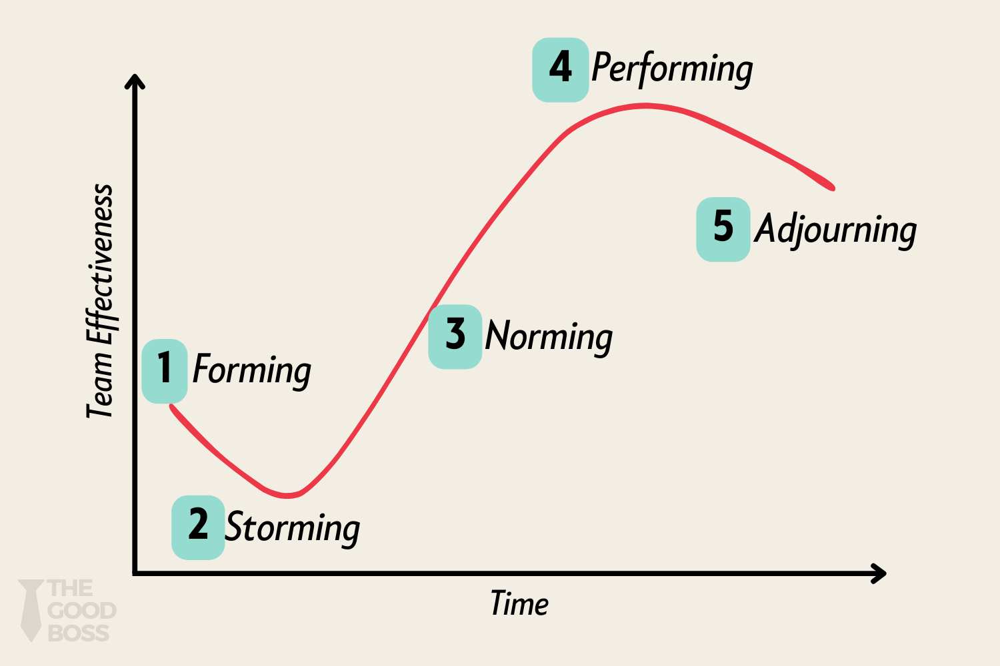
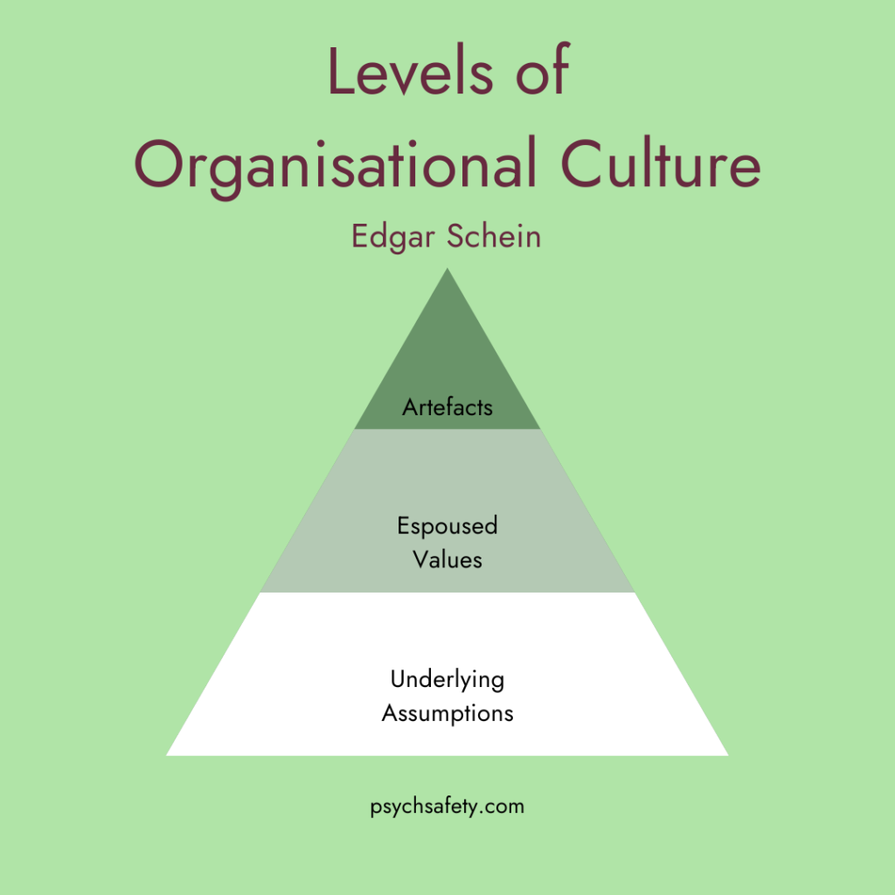

In this course, I mainly studied five core topics: individual behavior, motivation theories, group dynamics, leadership, and organizational culture. 

Individual behavior focuses on psychological and behavioral patterns of people in the workplace—how personality, attitudes, perception, and emotions affect a person’s performance at work. 

Motivation theories explore what drives employees to work hard, such as Maslow’s hierarchy of needs and Herzberg’s two-factor theory. 

Group dynamics examines how teams interact internally—how they form, how roles are assigned, how communication flows, and how conflicts are managed. 

Leadership looks at how different leadership styles impact team performance, for example, the difference between transformational and transactional leadership. 

Organizational culture refers to the “personality” or “atmosphere” of a company—it shapes employees’ norms and values. For instance, Google promotes innovation and freedom, while some traditional companies emphasize hierarchy and strict procedures.

## Individual Behavior

Individual behavior is about the psychological and behavioral characteristics of people in work settings. 

- For example, each of us has different personality traits—like being outgoing or shy—which affects whether we speak up in team meetings. 

We learned a model called the **Big Five Personality Model**, which breaks personality into five dimensions: extraversion, agreeableness, conscientiousness, emotional stability, and openness to experience. Someone high in conscientiousness tends to be punctual, careful, and reliable—qualities that make them more trustworthy when handling complex tasks. 

- For instance, in one of our group projects, a classmate was extremely organized: he always finished his part early and even helped check others’ work—this clearly showed high conscientiousness. 

We also studied “**job satisfaction**,” which refers to how employees feel about their jobs overall. Research shows that higher job satisfaction leads to lower turnover. 

- For example, a U.S. study found that for every 10% increase in job satisfaction, employee turnover drops by about 2.5%. This helps explain why companies care not only about skills but also about personality and attitude during hiring.

## Motivation Theory

In this course, motivation theory is another crucial part—it’s about understanding “why people are willing to work hard.” We focused on two classic models: Maslow’s Hierarchy of Needs and Herzberg’s Two-Factor Theory. 

**Maslow’s theory** suggests human needs are arranged like a pyramid, from basic to advanced: physiological needs, safety needs, social needs, esteem needs, and self-actualization needs. People only seek higher-level needs after lower ones are met. For example, a fresh graduate might first care about whether their salary can cover rent and food (physiological needs). Once that’s stable, they start caring more about relationships with coworkers (social needs) or whether their boss recognizes their effort (esteem needs). 

**Herzberg’s theory** divides factors affecting motivation into two categories: hygiene factors and motivators. Hygiene factors—like salary, working conditions, and company policies—don’t directly boost motivation, but their absence causes dissatisfaction. Think of air conditioning: you don’t feel excited because it’s there, but you’ll be miserable in summer without it. Motivators—such as achievement, responsibility, and growth opportunities—are what truly drive people to work harder. For instance, in a university research project, student teaching assistants who were given the chance to independently organize a seminar showed much higher engagement, because they felt growth and recognition—this is motivators in action.

## Group Dynamics

Group dynamics is the science of how teams function—it studies “what happens when people work together.” We learned **Tuckman’s Stages of Group Development**, which divides team growth into five phases: Forming, Storming, Norming, Performing, and Adjourning. 

- For example, in one of our class projects on market research, at the beginning, everyone was polite and cautious, just getting to know each other (**Forming**). 
- But soon, arguments broke out over who should do what and whose idea was better (**Storming**). 
- Then we held a meeting to set clear roles and rules—like having a short weekly meeting every Wednesday night and using a shared document to track progress (**Norming**). 
- After that, we worked more smoothly, became highly efficient, and successfully completed the report (**Performing**). 
- When the project ended, the team naturally disbanded (**Adjourning**). 

We also studied “**social loafing**”—<u>the tendency for people to slack off when they feel “hidden” in a group</u>.  

- For instance, an experiment found that when people think they’re shouting as part of a group, their individual volume drops by 30% compared to shouting alone. 

<u>To prevent this, our team always made individual contributions clear</u>—like who handled data analysis and who wrote the slides—so everyone felt accountable.

## Leadership

Leadership is one of the most interesting parts of this course because it’s about “how a person influences others to achieve goals.” We focused on two main styles: transformational leadership and transactional leadership. 

**Transformational leaders** inspire intrinsic motivation by sharing a vision, showing personal care, and encouraging creativity. 

- For example, Jack Ma is a classic transformational leader—he constantly painted Alibaba’s future vision, encouraged innovation, and said things like “making business easier for everyone,” which gave employees a strong sense of purpose. 

**Transactional leaders**, on the other hand, work more like “trading”—you do the job, I give you a reward; you fail, I correct you. 

- For instance, a sales manager might say, “Hit the target this quarter, get a bonus; miss it, lose performance points.” This style works well for short-term tasks but may lack long-term inspiration.

 Studies show teams led by transformational leaders perform about 20% better on average than those led transactionally. We also learned **Situational Leadership Theory**, which says leadership style should change based on the follower’s maturity. For example, with a new employee, you need more direction and control; with an experienced one, you should delegate more and show trust.

## Organizational Culture

Organizational culture is the study of a company’s “invisible rules” or “collective personality.” It’s not the written policies, but the unwritten norms people follow every day. We learned **Schein’s Three Levels of Culture**, which divides culture into artifacts, espoused values, and basic underlying assumptions. 

According to Schein, **the** **underlying assumptions of an organisation give rise to the espoused values**, which in turn shape the **the organisational artefacts** we see at the surface. The deeper you go, the more powerful, but also more difficult, change becomes. The artefacts are the things that are easy to see and change, but if we only shift surface-level artefacts without considering the deeper layers, these changes may not stick.

The underlying assumptions are the heart and soul, the undertone of the organisation that we cannot easily see or determine – and if we want to change an organisation, **it is here, in the depths of organisational culture, that we must ultimately work**. Shared, tacit beliefs influence everything that happens, but they’re difficult to uncover, and even more difficult to change. However, if we don’t uncover and engage with them, organisational change may not succeed anywhere other than at surface level.

- Artifacts are visible things—like office layout, dress code, or slogans. For example, when we visited a German company, we saw an open office with no private rooms—even the CEO sat at a regular desk—this reflected a culture of “equality” and “transparency.” 
- Espoused values are what the company officially says, like “customer first” or “innovation.” 
- But the real culture lies in the deepest layer: basic underlying assumptions—what employees truly believe in their hearts. For instance, a company might say “we encourage innovation,” but if employees get blamed for every mistake, they’ll eventually believe “actually, the company just wants no errors,” and stop trying new things. 

We also studied strong culture—when employees deeply share the company’s values. At Google, for example, most employees genuinely believe in “don’t be evil” and “move fast,” which strengthens unity. But strong culture can also lead to groupthink—when people want harmony so much that they suppress dissenting opinions.