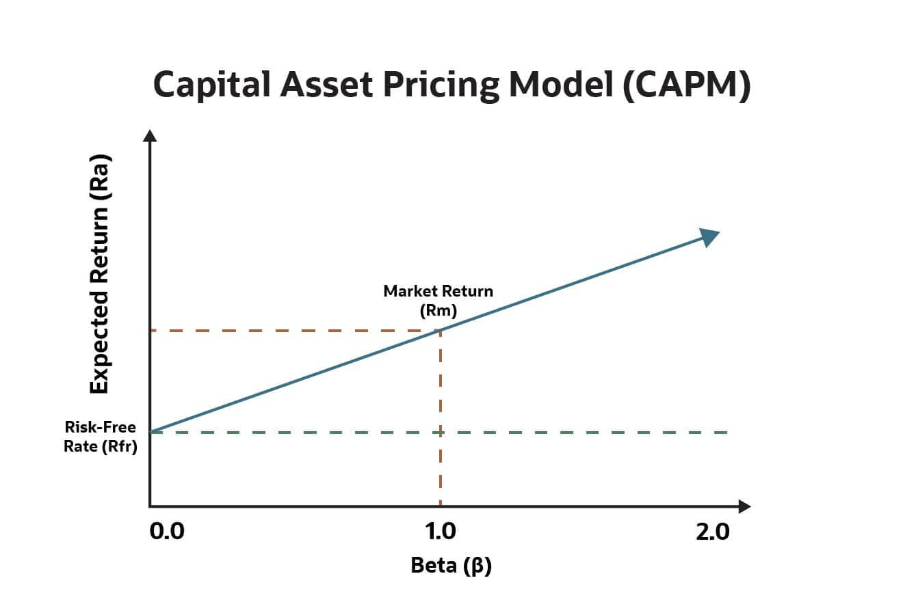

In this course, I mainly studied Portfolio Theory, the Capital Asset Pricing Model (CAPM), Risk Measurement and Management, Factor Models, and the basics of Quantitative Trading Strategies. 

These topics form the core of the course and helped me understand how to scientifically build and manage an investment portfolio, rather than investing based on gut feelings or emotions. Simply put, this course taught us how to use math and statistics to "smartly" allocate money across different assets—like stocks, bonds, or funds—so that we can aim for higher returns while keeping risks under control.

## Portfolio Theory

**Portfolio Theory** is developed by American economist Harry Markowitz, the core idea is simple: **don’t put all your eggs in one basket**. 

- For example, if you invest only in one company, like Tesla, and Tesla’s stock crashes, your entire investment suffers a huge loss. But if you also invest in Apple, Coca-Cola, and some government bonds, then even if Tesla drops, other assets might perform well, balancing out the overall risk. 

Markowitz used math to prove that by combining assets with low correlation—meaning they don’t move up and down together—you can significantly reduce overall risk without necessarily sacrificing expected returns. 

- Let me give a concrete example: suppose you have two options. Option one is to invest 100% in Stock A, which has an annual return of 10% but a volatility (that is, risk) of 20%. Option two is to split your money 50% in Stock A and 50% in Bond B, where Bond B gives 4% annual return with only 5% volatility. After calculation, the combined portfolio would have an expected return of about 7% (10%×0.5 + 4%×0.5), but the overall volatility might drop to around 12%, much lower than the 20% of Stock A alone. This shows that **by diversifying, we give up a little return but gain much more stability.** 

This idea is captured in the “Efficient Frontier”—a curve that shows the highest possible return you can get for each level of risk. We used Excel and Python to simulate hundreds of such portfolios, plotting their risk and return, and visually identifying which combinations are “optimal.”

## Capital Asset Pricing Model

Next is the Capital Asset Pricing Model, or CAPM. **This model helps answer a key question: for a specific stock or asset, how much return should it offer to be “worth” investing in?** Because different assets carry different risks, we can’t just pick the one with the highest past return. 

The core formula of CAPM is: **Expected Return = Risk-Free Rate + β × (Market Return – Risk-Free Rate).** 

The “**risk-free rate**” is usually represented by <u>government bond yields</u>—like the current yield on a 10-year German government bond, which is about 2.5%. 

The **market return** can be seen as <u>the average return of the entire stock market</u>—for example, the German DAX index has returned about 7% annually over the past 10 years. So the <u>market risk premium is 7% – 2.5% = 4.5%</u>. 

The most important parameter is **β (beta), which measures how much a stock tends to move relative to the overall market.** If a stock has a beta of 1.2, it’s more “excitable”—when the market goes up 10%, it tends to go up 12%; when the market drops 10%, it tends to drop 12%. Conversely, a beta of 0.8 means it’s more “calm,” moving less than the market. 

- We did a case study on Apple stock: its beta is about 1.1, the risk-free rate is 2.5%, and the expected market return is 7%. So according to CAPM, Apple’s “fair” expected return should be 2.5% + 1.1 × (7% – 2.5%) = 2.5% + 1.1 × 4.5% = 7.45%. If someone tells you Apple will return 15%, you should be cautious—because according to the model, such a high return either means the forecast is wrong, or the risk is extremely high. CAPM helps us judge whether an investment offers “good value for money,” just like checking the price-performance ratio when buying clothes.

## Risk Measurement and Management

Risk Measurement and Management is another highly practical part. We can’t just talk about returns—we also need to know how to measure and control risk. Two of the most common tools are Volatility and VaR (Value at Risk). 

**Volatility** <u>measures how wildly an asset’s price moves up and down, usually calculated as the standard deviation of returns.</u> 

- For example, if a stock’s daily return had a standard deviation of 2% over the past year, we say its daily volatility is 2%. Higher volatility means higher risk. 

<u>But volatility only tells us the “average” fluctuation—it doesn’t tell us “how bad things could get.”</u> 

That’s where **Value at Risk (VaR)** comes in. VaR answers: <u>under a certain confidence level, say 95%, over a specific period, say one day, what’s the maximum loss we could expect?</u> 

- For example: suppose you hold a €100,000 stock portfolio. Based on historical data simulation, we find its 1-day VaR at 95% confidence is €8,000. This means, under normal market conditions, we are 95% confident that your loss in one day won’t exceed €8,000. In other words, in about one out of every 20 trading days (roughly one day per month), the loss might exceed €8,000. 

We did an exercise using Commerzbank stock data: we calculated its daily returns over the past three years and used statistical methods to estimate VaR. We found that during extreme events, like the 2023 banking crisis, the actual loss exceeded the VaR prediction. This shows <u>VaR has limitations, but it’s still a crucial risk management tool</u>—like a seatbelt in a car: <u>it can’t prevent all accidents, but it greatly reduces potential harm.</u>

## Factor Models

**Factor Models** help us understand “**what actually drives stock returns**.” Simply put, <u>a stock’s return can be broken down into the influence of several common factors</u>. 

The most famous model is the Fama-French **Three-Factor Model**, which argues that besides the overall market movement (<u>market factor</u>), two other factors matter: one is the “<u>size factor</u>” (SMB, Small Minus Big), meaning small-cap stocks tend to outperform large-cap stocks over the long term; the other is the “<u>value factor</u>” (HML, High Minus Low), meaning stocks that are cheap relative to their fundamentals—“value stocks”—tend to do better than expensive “growth stocks.” 

- For example, when we analyzed the German stock market, we found that from 2010 to 2020, small-cap companies delivered an average annual return 1.8 percentage points higher than large caps, and high book-to-market (value) stocks returned 2.3 percentage points more per year than low book-to-market stocks. These numbers show that investors can earn extra returns by intentionally allocating to small-cap and value stocks. 

Today, factor investing has become a mainstream strategy, and many ETFs are designed based on these factors—like funds that specifically target “low volatility” or “high dividend” stocks.

Finally, we got an introduction to Quantitative Trading Strategies. This means using computer programs to automatically make and execute investment decisions, instead of relying on humans to watch the market and place orders. 

One common strategy we practiced is the “**Momentum Strategy**,” based on the idea that “winners keep winning”—stocks that performed well in the past may continue to rise in the near future. 

- For example, we selected the 30 stocks in the DAX30 index, calculated their returns over the past 6 months, picked the top 10 performers, built a portfolio, and held it for 6 months. We backtested this strategy using data from 2015 to 2020 and found it achieved an annualized return of 9.2%, compared to the DAX index’s 6.8% over the same period. 

Of course, momentum strategies don’t always work—during the March 2020 pandemic crash, tech stocks that had risen sharply earlier plummeted, causing large losses for the strategy. But by adding risk controls, like a stop-loss rule (automatically selling if losses exceed 15%), we can reduce the damage. This taught me that quantitative strategies aren’t “money printers”—they are systems that require constant testing, optimization, and monitoring.