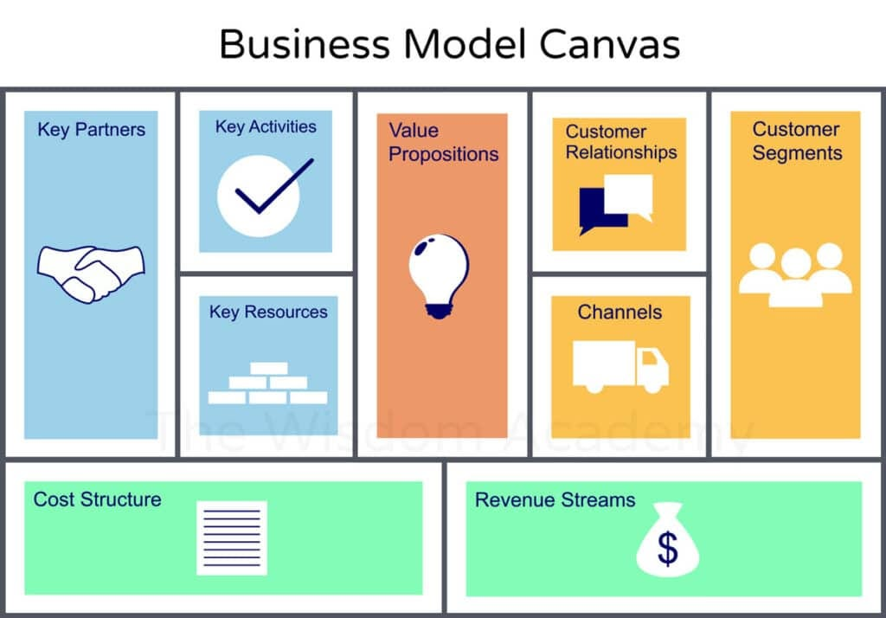

In this course, I mainly studied the Business Model Canvas, Five Forces Analysis, Value Chain Analysis, Blue Ocean Strategy, and Core Competence. 

These concepts helped me systematically understand how a company designs its operational logic, competes in the market, and formulates long-term development strategies. 

## Business Model Canvas

In this course, I mainly studied the Business Model Canvas, which is **a structured framework about how a company creates, delivers, and captures value**. <u>The canvas consists of nine building blocks, laid out like a table, breaking down a company’s business model into Customer Segments, Value Propositions, Channels, Customer Relationships, Revenue Streams, Key Resources, Key Activities, Key Partnerships, and Cost Structure</u>. You can think of it as a “health check-up form” for a business—managers or entrepreneurs can quickly see what their company is really doing, for whom, and how it makes money. 

- For example, we analyzed the case of DiDi Chuxing: its customer segments are mainly urban commuters and private car owners; its value proposition is “quickly matching riders with drivers to reduce waiting time”; its channel is the mobile app; its revenue stream comes from a commission on each ride, roughly 20%; and its key resources are the platform’s algorithm and its massive database of drivers and users. Through this canvas, we can clearly see DiDi’s entire business logic at a glance, rather than running the business based on gut feeling. This is especially useful during startup phases or business transformations, helping avoid many blind decisions.

## Five Forces Analysis

In this course, I mainly studied **the Five Forces Analysis, a tool for analyzing the intensity of competition in an industry**, developed by Harvard professor Michael Porter. The “five forces” are: **rivalry among existing competitors, threat of new entrants, threat of substitutes, bargaining power of suppliers, and bargaining power of buyers**. Together, these five forces determine the profit potential of an industry. 

> For example, we analyzed China’s shared bike industry: 
>
> first, rivalry among existing players was extremely high—Mobike and ofo once competed fiercely in hundreds of cities, flooding the market with over ten million bikes, indicating intense competition; 
>
> second, the threat of new entrants was high because the technology barrier was low—anyone with capital could quickly enter; 
>
> third, the threat of substitutes was clear—subways, buses, and e-bikes can all replace short-distance cycling; 
> fourth, suppliers’ bargaining power was weak because there were many bike manufacturers, so companies could easily switch; 
>
> and finally, buyers (users) had strong bargaining power because they could ride for free or very cheaply, and switching apps was easy. 

Through this analysis, we can understand why the shared bike industry overall suffered long-term losses—the five forces all worked against profitability. This model helps us move beyond just focusing on direct competitors and see the broader competitive landscape more clearly.

## Value Chain Analysis

In this course, I mainly studied **Value Chain Analysis, which is about how a company internally creates value step by step.** Porter suggested that every company can be seen as a series of interconnected activities, divided into “primary activities” and “support activities.” Primary activities include inbound logistics, operations, outbound logistics, marketing & sales, and service; support activities include firm infrastructure, human resource management, technology development, and procurement. By analyzing these steps, a company can identify where it can reduce costs or enhance customer value. 

For example, we studied the case of Dell Computers: Dell’s business model is “build-to-order”—customers customize their PC online, and Dell assembles and ships it. This makes its “operations” highly efficient, with inventory cycles as short as a few days, compared to over 30 days for traditional PC makers like HP. As a result, Dell saves significant warehousing costs in both “inbound” and “outbound logistics,” and customers receive their products faster. This is a classic example of value chain optimization—not winning through advertising, but through improving internal processes. This method teaches us that competitive advantage doesn’t only come from the external market, but also from fine-tuned internal management.

## Blue Ocean Strategy

In this course, I mainly studied Blue Ocean Strategy, which is about how companies can avoid fiercely competitive “red oceans” and instead create uncontested “blue oceans” of market space. A red ocean refers to existing markets where companies fight for share, and profits shrink—like the market for basic smartphones. A blue ocean is a new, untapped market space. 

For example, when Apple launched the iPhone, it didn’t just make another phone—it combined a phone, an iPod, and an internet communicator into one device, creating a whole new market for smart devices. The core tools of Blue Ocean Strategy are the “Strategy Canvas” and the “Four Actions Framework”: Eliminate, Reduce, Raise, and Create. For instance, we analyzed Netflix: it “eliminated” physical stores and DVD rental limits, “reduced” the time users spent searching for movies (via algorithmic recommendations), “raised” content variety (through original series like *House of Cards*), and “created” an unlimited streaming subscription model. As a result, it completely transformed the traditional video rental industry. This strategy taught me that true innovation isn’t about doing better than competitors—it’s about doing something no one else has thought of, thereby escaping competition altogether.

## Core Competence

In this course, I mainly studied Core Competence, which refers to a company’s most unique and hard-to-imitate capabilities—the foundation of long-term success. Core competence is not about a single product or technology, but about the ability to integrate resources, skills, and knowledge. 

For example, Honda’s core competence is not just engines, but the ability to make small internal combustion engines extremely lightweight, efficient, and reliable. This capability allows it to produce not only motorcycles, but also generators, lawnmowers, and cars. Another example we analyzed is Huawei: its core competence lies in sustained high-level R&D investment and rapid product iteration. Data shows that Huawei invests over 140 billion RMB annually in R&D—more than 20% of its revenue—and nearly 50% of its employees are R&D staff. This capability has enabled it to build a global leadership position in 5G telecom equipment, maintaining technological edge even under external pressure. Core competence is like the root of a tree, while products are the fruits—only with deep roots can new fruits keep growing. This concept taught me that a company shouldn’t just focus on whether its current products sell well, but whether it has a “secret weapon” that others can’t take away.