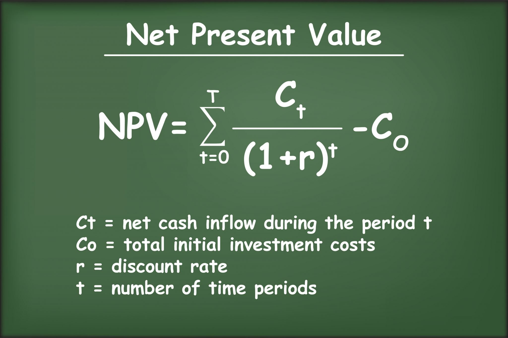

In this course, I mainly studied five core topics: financial statement analysis, capital budgeting decisions, capital structure management, working capital management, and the trade-off between risk and return. 

Financial statement analysis is about how to read a company’s “financial report card,” capital budgeting is about whether a company should spend money on new investment projects, capital structure management is about the “mix” of how much money comes from the company’s own funds versus borrowed money, working capital management is about managing the “lifeblood” of daily operations—cash, inventory, and accounts receivable—and the risk-return trade-off is a central theme that runs through all financial decisions, emphasizing the basic idea that “higher returns usually come with higher risks.” 

This course teaches us how to use numbers to make smarter financial decisions for a company—just like a doctor uses a medical report to assess a person’s health, we use financial data to evaluate a company’s financial “health.”

## The time value of money

In financial management, the concept of the time value of money is one of the most fundamental and important ideas. It means that **a dollar today is worth more than a dollar in the future**. Why? Because **money can earn interest or returns over time**. 

- If you have 10,000 yuan today, you can invest it—put it in a bank, buy bonds, or fund a project—and in one year, it might grow to 10,500 yuan if it earns 5% annual interest. So, receiving money earlier allows you to use it to generate more money. 

This principle is the foundation for many financial decisions, such as evaluating investment projects, comparing loan options, or planning for retirement. To make fair comparisons between cash flows at different times, we use two main techniques: present value and future value. 

**Future value** tells us how much money today will be worth in the future. 

- For example, if you invest 10,000 yuan at 5% interest per year, in two years it will grow to 11,025 yuan—this is the future value. 

**Present value** does the opposite: it tells us how much a future sum of money is worth today. 

- For instance, if someone promises to pay you 11,025 yuan in two years, and the interest rate is 5%, the present value of that money is only 10,000 yuan. 

We “discount” the future amount back to today using a discount rate, which reflects the opportunity cost of capital—what you could have earned if you invested the money elsewhere.

## Capital budgeting decisions

Capital budgeting decisions are about **whether a company should invest in a long-term project**, such as building a new production line or launching a new product. 

We use several methods to evaluate this: the most common is **Net Present Value (NPV)**, which **discounts future cash inflows to their present value using a reasonable interest rate and subtracts the initial investment**. 

- For example, when a company considers building a new factory that will generate cash inflows over the next 10 years, it doesn’t just add up all the future cash—it discounts each year’s cash flow back to its present value and then subtracts the initial investment. If the result is positive, the project creates value. 

Without considering the time value of money, companies might mistakenly accept projects that look profitable on paper but actually destroy value because the returns come too slowly. So, this idea helps us make smarter, more realistic financial choices by recognizing that timing matters just as much as the amount.

- For example, a project requires a 10 million yuan upfront investment and is expected to generate 4 million yuan in cash each year for the next three years. If we use a 10% discount rate, the present value of these future cash flows totals about 9.94 million yuan. Subtracting the 10 million yuan investment gives an NPV of -60,000 yuan, meaning the project isn’t worth pursuing because it doesn’t meet our required return. 

Another method is **Internal Rate of Return (IRR)**, is a key method we use in financial management to evaluate whether an investment project is worth pursuing. Simply put, the IRR is the annualized rate of return that a project is expected to generate over its lifetime, based solely on its cash flows—meaning the money you put in and the money you expect to get back. It’s called “internal” because it only depends on the project’s own cash inflows and outflows, not on external interest rates or market conditions.

Here’s how it works: imagine a company is thinking about investing in a new delivery truck that costs 500,000 yuan upfront. The company expects the truck will help save on delivery costs and generate 150,000 yuan in cash each year for the next four years. The IRR is the special interest rate at which the present value of these future cash inflows exactly equals the initial investment. In other words, it’s the discount rate that makes the Net Present Value (NPV) of the project equal to zero. Using a financial calculator or software, we can find that in this case, the IRR is about 18.45%. This means the project effectively earns an 18.45% annual return on the money invested.

Now, to decide whether to go ahead, the company compares this IRR to its required rate of return—also called the “hurdle rate”—which might be 12%. Since 18.45% is higher than 12%, the project looks attractive and should be accepted. If the IRR were lower than the hurdle rate, it would mean the project isn’t earning enough to justify the risk, and it should be rejected.

However, IRR has some limitations. One common issue is with projects that have non-conventional cash flows—like when a project requires additional large investments in later years. In such cases, there might be more than one IRR, which can confuse the decision. Also, IRR doesn’t tell us the actual dollar value created, just the percentage return. That’s why we often use IRR together with NPV: NPV tells us how much value is added in yuan, while IRR tells us the efficiency or return rate of the investment. Together, they give a more complete picture for making sound financial decisions.